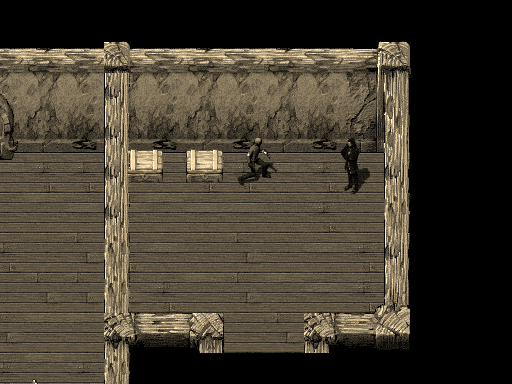

#2D Game Engine Demo
This is a an early tech demo of my 2D game engine.

The game engine itself is written in modern C++. It's scriptable with Lua and JSON. It supports basic features, such as 2D graphics & animations, stereo sound, simple cutscenes, save games, dialogues, lighting, and day & night cycles.

**For now, only the tech demo (along with the scripting API) is open-sourced and not the engine itself.** 

##Disclaimer
Note that the art assets (images, sounds, music, fonts) used in the demo are NOT my work - they come from various authors with whom I'm not affiliated in any way. Refer to [CREDITS.txt](CREDITS.txt) file for more information.

##Installation
The game requires [SFML 2.3](http://www.sfml-dev.org/) and [LuaJIT 5.1](http://luajit.org/) runtime libraries to be present on the host machine.

###Ubuntu 16.04

For Ubuntu-based distributions (assuming that git is installed), the entire installation process may be accomplished with the following commands:
```bash
mkdir -p ~/game-demo && cd ~/game-demo && git clone https://github.com/pdereg/2d-game-engine-demo.git && sudo apt-get install libsfml-graphics2.3v5 libsfml-network2.3v5 libsfml-system2.3v5 libsfml-window2.3v5 libsfml-audio2.3v5 libluajit-5.1-2 -y
```

##Modding
Everything that can be modded is contained within `data` directory. Besides changing art assets, it's possible to fully customize game entities, maps and scripts.

###Entities
All entities are defined in [data/entities.json](data/entities.json) file. Each entity template is a separate JSON dictionary with a unique name and a set of configurable attributes. 

Entities may optionally describe how they should be animated. All entity animations are defined in [data/animations.json](data/animations.json) file.

See the [Wiki Page](https://github.com/pdereg/2d-game-engine-demo/wiki/Modding-Entities) for more information about modding entities.

###Maps
Maps are stored in `data/maps` directory. The engine uses only two maps: one for the main menu, and one for the game itself. They both need to be `.tmx` files, which is a map format used by [Tiled Map Editor](http://www.mapeditor.org/).

The engine supports layers, animated tiles and (to a limited extent) tile collision boxes.

See the [Wiki Page](https://github.com/pdereg/2d-game-engine-demo/wiki/Modding-Maps) for more information about modding maps.

###Scripts

Game levels are scriptable with Lua. The engine expects to find one `main.lua` file within both `data/scripts/menu` and `data/scripts/game` directories. Loading other scripts is possible through Lua's built-in `require` function.

A high-level API is exposed to ease game level scripting. A comprehensive documentation is available in [data/api](https://github.com/pdereg/2d-game-engine-demo/tree/master/api) directory.

##Gallery
Below are animated GIFs that present some of the things that are possible to do with the engine.



